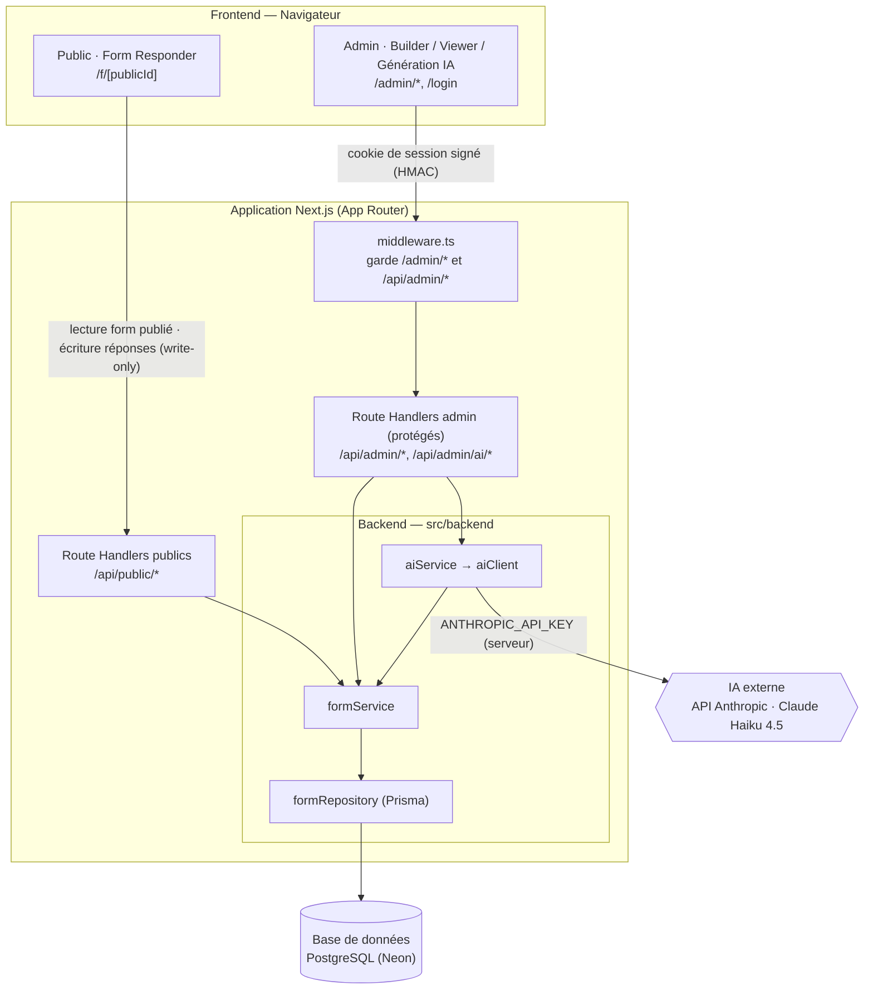

# CleverForm

**Mini-clone de Typeform** (_Form Builder & Responder_) — cas pratique technique CleverConnect.

Application web fullstack permettant de :

1. **Créer** des questionnaires personnalisables (_Form Builder_).
2. **Diffuser et remplir** les formulaires côté public (_Form Responder_).
3. **Visualiser** les réponses collectées (_Response Viewer_).
4. **Générer** un questionnaire à partir d'un simple prompt (**IA**).

## Table des matières

- [Contraintes techniques](#contraintes-techniques)
- [Stack technique](#stack-technique)
- [Architecture](#architecture)
- [Démarrage rapide](#démarrage-rapide)
- [Commandes (Make)](#commandes-make)
- [Tests & couverture](#tests--couverture)
- [Documentation](#documentation)
- [Workflow Git](#workflow-git)

## Contraintes techniques

- **Next.js** (dernière version stable) — frontend + backend, **TypeScript** partout.
- **Base de données** : **SQL** (MySQL, SQLite ou service type Supabase/PostgreSQL).
- Bibliothèques tierces libres, **sauf** SDK de services de formulaires (Typeform & équivalents).

## Stack technique

| Couche | Choix |
|--------|-------|
| Framework (front + back) | **Next.js** (App Router) |
| Langage | **TypeScript** (`strict`) |
| Base de données | **PostgreSQL** (Neon, via Vercel) |
| ORM | **Prisma 7** (driver adapter `@prisma/adapter-pg`) |
| Conteneurisation | **Docker** (portabilité / compatibilité ; livraison via Vercel) |
| Commandes | **Make** (interface agnostique) |
| UI | **MUI (Material UI)** — thème clair/sombre, détection système |
| Icônes animées | **lordicon** (`@lordicon/react` + Lottie JSON **auto-hébergés**, sans CDN) |
| Visualisation des composants | **Storybook** (rendu/doc des composants) |
| Formulaires & validation | **React Hook Form + Zod** |
| Drag & drop (builder) | **dnd-kit** |
| IA | **Claude Haiku 4.5** (`@anthropic-ai/sdk`), sortie structurée validée Zod |
| Tests | **Jest** (unitaire + intégration) + **Cypress** (e2e + système) |
| CI / CD | **GitHub Actions** + **Vercel** |

Détails et justifications : [`docs/architecture.md`](./docs/architecture.md).

## Architecture

Séparation claire **frontend / backend** en couches, au sein d'une unique application Next.js.
Les dépendances pointent vers le `shared` : `app` → (`frontend` | `backend`) → `shared`.

**Vue d'ensemble** des flux (cloisonnement public / admin par `middleware.ts`,
surface publique write-only, clé IA côté serveur) :



**Structure des dossiers** :

```
src/
  middleware.ts   # garde /admin/* et /api/admin/*
  app/            # App Router — pages + Route Handlers
    admin/        # espace admin protégé (Builder, Response Viewer, génération IA)
    f/[publicId]/ # Form Responder public (jeton opaque, formulaires publiés)
    api/
      admin/      # routes backend protégées (IA, opérations builder, réponses admin)
      public/     # routes backend publiques (lecture form, soumission — write-only)
  frontend/       # présentation : composants, hooks, vues
  backend/        # métier : services, accès données (Prisma), intégration IA
    form/         #   formService + formRepository + formMapper
    response/     #   responseService + responseRepository + responseMapper
    ai/           #   aiService + aiClient + aiMapper (admin uniquement)
    auth/         #   adminSession + rateLimit + requireAdmin
  shared/         # domaine : entités, types, schémas Zod (framework-agnostic)
    schemas/      #   createFormSchema, submitResponseSchema, loginSchema, DTO publics…
```

| Couche | Rôle | Côté |
|--------|------|------|
| `app/` | Points d'entrée Next.js (routing, RSC, Server Actions, Route Handlers) | front + back |
| `frontend/` | Présentation : composants, hooks, vues | **frontend** |
| `backend/` | Métier : services/use-cases, accès données Prisma, intégration IA | **backend** |
| `shared/` | Domaine : entités, types, schémas Zod (sans dépendance framework) | **partagé** |

**Découpage fonctionnel** :

| Module | Pages / Routes | Accès |
|--------|---------------|-------|
| **Form Builder** | `/admin/forms/[id]/edit` | admin |
| **Form Responder** | `/f/[publicId]` | public (formulaires `PUBLISHED` uniquement) |
| **Response Viewer** | `/admin/forms/[id]/responses` | admin |
| **Génération IA** | `/api/admin/ai/*` | admin (aucune route publique) |

**Sécurité & accès** : administrateur unique (cookie signé HMAC, sans table `User`), `publicId` opaque non devinable, surface publique write-only, prompt IA borné à 1 000 car. → [`docs/security.md`](./docs/security.md).

**RGPD** : mention de confidentialité + consentement obligatoire, minimisation (aucun cookie/IP/traceur côté public), registre art. 30 → [`docs/rgpd.md`](./docs/rgpd.md).

Détails architecture, routes API, coût IA et conventions de nommage : [`docs/architecture.md`](./docs/architecture.md).

## Démarrage rapide

### Prérequis

- Node.js 22+, npm
- [Docker](./docs/docker.md) (pour `make docker-up` et les tests d'intégration en local)
- Compte Vercel lié au projet (pour `make db-pull`)

### Installation

```bash
cp .env.example .env
# Renseigner ANTHROPIC_API_KEY, ADMIN_PASSWORD, SESSION_SECRET
make install    # dépendances
make db-pull    # récupère les variables Neon (DATABASE_URL…) dans .env.local
make db-deploy  # applique les migrations Prisma
make dev        # serveur de développement — http://localhost:3000
```

### Variables d'environnement requises

| Variable | Rôle |
|----------|------|
| `DATABASE_URL` / `DATABASE_URL_UNPOOLED` | Connexion Neon (runtime poolé / migrations directes) |
| `ANTHROPIC_API_KEY` | Clé IA (serveur uniquement) |
| `ADMIN_PASSWORD` | Mot de passe de l'administrateur unique |
| `SESSION_SECRET` | Secret HMAC de signature du cookie de session admin |

La base **PostgreSQL (Neon)** est provisionnée via l'**intégration Marketplace Vercel**. En **Prisma 7**, la connexion runtime passe par un driver adapter (`DATABASE_URL` poolée) et les migrations par l'URL directe (`DATABASE_URL_UNPOOLED`). Répartition dev / preprod / prod ↔ branches git et preview branching Neon : [`docs/architecture.md`](./docs/architecture.md). Détail Prisma & migrations : [`docs/data-model.md`](./docs/data-model.md).

## Commandes (Make)

Interface unique, identique en local et en CI — voir [`docs/tooling.md`](./docs/tooling.md) :

```bash
make install        # dépendances
make dev            # développement local
make build          # build de production
make lint typecheck # qualité
make db-deploy      # applique les migrations Prisma (preprod/prod/CI)
make db-status      # état des migrations vs base
make docker-up      # app + Postgres en local (Docker, compatibilité)
make storybook      # visualisation des composants (port 6006)
make help           # liste toutes les cibles
```

> Livraison via **Vercel** ; **Docker** sert la portabilité / les vérifications de compatibilité → [`docs/docker.md`](./docs/docker.md).

## Tests & couverture

Pyramide complète, **frontend / backend séparés** par niveau — détail : [`docs/testing.md`](./docs/testing.md).

| Niveau | Côté | Outil | Portée |
|--------|------|-------|--------|
| **unitaire** | front + back | Jest | composants, hooks, schémas Zod, mappers, logique pure |
| **intégration** | back | Jest + **Postgres de test** | Route Handlers → services → Prisma (données réelles) |
| **système** | back | Cypress (`cy.request`) | API de bout en bout via HTTP, dont le chemin IA réel |
| **e2e** | front | Cypress (navigateur) | parcours Builder / Responder / connexion admin |

> Aucune **donnée métier mockée** : fixtures réelles et BDD de test dédiée (jamais la base Neon de production). Les stubs se limitent aux **frontières** techniques en unitaire front, isolés et documentés.

### Couverture (rapport du 2026-06-17)

Mesurée par Jest sur **tout** `src/` (unitaire + intégration) :

| Métrique | Couverture | Détail |
|----------|-----------|--------|
| **Statements** | **82,94 %** | 1493 / 1800 |
| **Branches** | **77,16 %** | 517 / 670 |
| **Functions** | **82,07 %** | 325 / 396 |
| **Lines** | **83,89 %** | 1438 / 1714 |

**454 tests Jest** (56 suites) au vert + parcours **système / e2e** Cypress.

```bash
make test-unit                             # unitaire (front + back)
make test-db-up && make test-integration   # intégration (Postgres de test)
make test-system                           # système — API + chemin IA réel
make test-e2e                              # e2e navigateur
npx jest --coverage --runInBand            # rapport de couverture (HTML : ajouter --coverageReporters=html)
```

## Documentation

La documentation détaillée vit dans le dossier [`docs/`](./docs) :

| Doc | Contenu |
|-----|---------|
| [Architecture](./docs/architecture.md) | Stack, structure, choix techniques, arbitrages, routes API, coût IA, conventions de nommage |
| [Design & UX](./docs/design.md) | Parcours utilisateur, composants, états de l'interface, thème clair/sombre |
| [Accessibilité](./docs/accessibility.md) | Clavier & focus visible, `prefers-reduced-motion`, contrastes, test axe automatisé |
| [Storybook](./docs/storybook.md) | Visualisation des composants, thème clair/sombre, conventions des stories |
| [Modèle de données](./docs/data-model.md) | Entités (`Form`, `Question`, `Response`, `Answer`), relations, schémas Zod, migrations Prisma |
| [Sécurité & accès](./docs/security.md) | Auth admin unique, cloisonnement admin/public, verrou IA, validation des entrées, audit npm |
| [RGPD](./docs/rgpd.md) | Conformité, registre des activités de traitement (art. 30), [export CSV](./docs/rgpd-registre.csv) |
| [Tests](./docs/testing.md) | Stratégie unitaires / intégration / e2e / système, politique de mocks, couverture détaillée |
| [CI / CD](./docs/ci-cd.md) | CI à deux niveaux (dev rapide / main long), déploiement Vercel, variables d'environnement |
| [Docker](./docs/docker.md) | Portabilité (anti vendor lock-in), build/run/disponibilité |
| [Outillage (Make)](./docs/tooling.md) | Interface de commandes agnostique, assistant IA de développement |
| [Workflow Git](./docs/git-workflow.md) | Branches, protection de `main`, cycle des PR |
| [Bottlenecks & améliorations](./docs/ameliorations.md) | Observabilité, analytics produit, IA (coût/latence), scalabilité, déploiement |

## Workflow Git

Modèle à **deux branches permanentes** :

| Branche | Rôle |
|---------|------|
| `main` | **Production** — code stable, déployable. **Branche protégée.** |
| `dev` | **Intégration** — développement courant, base des branches de fonctionnalité. |

### Règles clés

- **Aucun commit direct** sur `main` ni `dev` — tout passe par des Pull Requests.
- **PR vers `dev`** : fusion autorisée dès que **tous les checks CI sont au vert** (lint, typecheck, tests unitaires + intégration).
- **PR vers `main`** : l'assistant ouvre et remplit la PR, mais **ne la fusionne jamais** — la mise en production est une **validation humaine** (Jérôme), même avec tous les checks au vert.
- **Hotfix** : branche `hotfix/<nom>` depuis `main`, fusionnée dans `main` **et** `dev`.

### Cycle d'une fonctionnalité

1. **Issue GitHub** décrivant le travail.
2. **Branche** dérivée de `dev` : `<préfixe>/<n°issue>-<desc>` (ex. `feat/12-form-builder`).
3. **Développement** (+ mise à jour `README` / `docs`).
4. **PR vers `dev`**, remplie (`Closes #<n°>`).
5. **Fusion dans `dev`** dès que tous les checks sont au vert (auto-merge autorisé).
6. **Suppression** de la branche.

Préfixes : `feat/` · `fix/` · `doc/` · `refactor/` · `test/` · `chore/`.

Détails et configuration de la protection de `main` : [`docs/git-workflow.md`](./docs/git-workflow.md).
